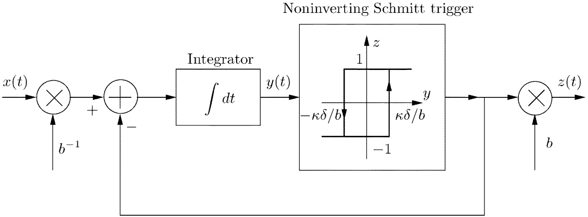
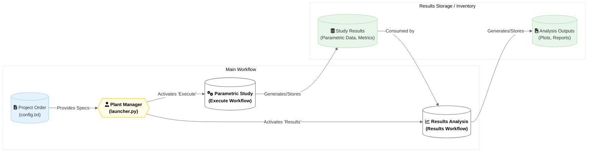

# TEM-TDM Toolkit
This Python toolkit is designed to assess the validity and performance of Asynchronous Sigma-Delta Modulators (ASDM) when used as Time Encoding Machines (TEM) and Time Decoding Machines (TDM), particularly for complex or turbulent signals. 

It implements and analyzes the concepts presented in the paper **[Perfect Recovery and Sensitivity Analysis of Time Encoded Bandlimited signals](docs/resources/Perfect-Recovery-and-Sensitivity-Analysis-of-Time-Encoded-Bandlimited-signals.pdf)** by Lazar and Tóth (IEEE TCAS-I, 2004), developed by researchers in the [Bionet Group at Columbia University](http://www.bionet.ee.columbia.edu/research/nipm/tems). The toolkit specifically allows for studying the *normalized equivalent circuit* proposed in the paper, focusing on how the **normalized threshold (`d_norm`)** affects signal recovery. 



The core idea tested is that by carefully selecting the normalized threshold `d_norm` (related to the ASDM's hysteresis (`delta`, bias `b` and gain `k`), a bandlimited signal can be efficiently represented by asynchronous spike times and recovered with high fidelity, potentially outperforming uniform sampling at equivalent data rates under certain conditions.

> [!NOTE]
> **Developer's Note:** This toolkit evolved alongside my understanding for my final degree project. While learning, I built features for parametric studies on sampling frequency (`fs`) and both `fs`/`d_norm`. Later, I realized that for this asynchronous ASDM, only the study on the normalized threshold (d_norm) is truly meaningful theoretically. The other studies still work because the code is flexible, but the main focus now should be the `d_norm` results. I've kept the extra study code because it was already built and represents the project's maturity process. Future analysis using this tool should prioritize the `d_norm` study.

## Core Concepts 

1. **Time Encoding/Decoding (TEM/TDM):** A method where signal amplitude information is encoded into the timing of discrete events (spikes or level crossings) rather than sampled at fixed intervals. 

2. **Asynchronous Sigma-Delta Modulator (ASDM):** A feedback system typically consisting of an integrator, a quantizer (like a Schmitt trigger), and a feedback loop. In this context, it acts as the TEM, generating spike times based on the input signal. 

3. **Perfect Recovery Condition:** The referenced paper shows that under certain conditions (specifically, if the time between consecutive spikes is bounded, related to the Nyquist rate and signal bounds), the original bandlimited signal can be perfectly recovered from the spike times. 

4. **Normalized Threshold (`d_norm`):** The paper introduces an equivalent circuit where the ASDM's Schmitt trigger hysteresis is normalized. This `d_norm` parameter (measured in seconds in the equivalent circuit) is crucial for recovery quality. Because the ASDM operates asynchronously, traditional sampling frequency isn't the primary tuning parameter; `d_norm` is key. 

5. **Parametric Analysis:** This toolkit focuses on studying how varying `d_norm` impacts the accuracy (e.g., error analysis: Median error, Normalized Mean Squared Error) and efficiency (e.g., number of spikes) of the encoding-decoding process, aiming to find an optimal `d_norm` for a given signal. 

6. **Comparison Analyses:**  
	- **Nyquist Analysis:** Compares the ASDM recovery to traditional uniform sampling at different rates, up to the rate achieved by the ASDM with the optimal `d_norm`.
	- **Fourier Analysis:** Compares the frequency spectrum of the original signal, the ASDM-recovered signal, and a traditionally sampled signal. 

## Project Structure

```plaintext
├── docs                     # Documentation and diagrams
│   ├── managers             # Managers' documentation
│   ├── functionalities      # Core functions' documentation
│   ├── resources            # Resources accessible to the toolkit: images, .pfd, ...
│   └── project.md           # Toolkit overview
├── src                      # Source code
│   ├── controllers          # Handlers for configuration, input, studies, results
│   │   ├── configuration.py
│   │   ├── input_handler.py
│   │   ├── parametric_handler.py
│   │   └── results_handler.py
│   ├── models               # Signal generation/loading functions
│   │   └── input_signal.py
│   ├── parametric           # Parametric study implementation
│   │   └── studies.py
│   ├── analysis             # Nyquist, Fourier, Optimal conditions analysis
│   │   ├── nyquist.py
│   │   ├── fourier.py
│   │   └── optima.py
│   ├── utilities            # Core ASDM, metrics, logging, plotting, helpers
│   │   ├── asdm.py
│   │   ├── metrics.py
│   │   ├── logging.py
│   │   ├── plotting.py
│   │   └── utils.py
├── Input                    # Folder for input data files (e.g., signal.csv)
├── Output                   # Folder for all generated results (plots, data, logs)
│   ├── parametric_delta     # Results for delta parametric study
│   ├── (parametric_freq)    # Optional: Freq study results
│   ├── (parametric_...)     # Optional: Other study results
│   ├── nyquist              # Results for Nyquist analysis
│   ├── fourier              # Results for Fourier analysis
│   ├── optima               # Results for optimal conditions study
├── launcher.py              # Main script to run the toolkit
├── config.txt               # Configuration file for specifying runs
├── requirements.txt         # Python package dependencies
└── TEM-TDM_Toolkit.ipynb    # Code to be run in Google Colab
```

## Repository explanation: Manufacturing plant analogy

I like to think of TEM-TDM as a signal-processing manufacturing plant that receives a project order with detailed requirements (`config.txt`). Based on this order, the plant manager (`launcher.py`) determines which **workflow** to activate: *'execute'* or *'results'*.
* The *'execute'* workflow is the plant's production line. It generates inventory (the results of parametric studies) as specified in the project order (`config.txt`). The raw materials for this production are input signals, which can come from external suppliers (experimental data in `.csv` or `.xlsx` files) or be manufactured in-house (generated signals like `multisin`, `multifreq`, and `paper`).
* The *'results'* workflow is the plant's analysis department. It consumes inventory (the results of parametric studies). This inventory can be freshly produced by the *'execute'* workflow or retrieved from the plant's warehouse (the *Output folders*, from past studies).

Both workflows have their own **department managers**. 
* The *'execute'* workflow, for instance, calls upon the *parametric studies manager*, who organizes the production according to the order: running the studies, logging data, and creating plots.
* The *'results'* workflow calls the *results manager*, who organizes the specified analyses: the Nyquist study, the Fourier Analysis, the optimal conditions study, and the generation of plots.



## How it Works: The Signal Processing Plant Analogy

Thinking of the TEM-TDM Toolkit as a specialized manufacturing plant for processing and analyzing signals using ASDM techniques, one can further understand how the tool works. As a manufacturing plant, the code follows defined steps:

1.  **Receiving the Project Order (`config.txt`):** The entire operation starts with a detailed project order or blueprint (`config.txt`). This document specifies exactly what needs to be done: the raw material (which input signal to use), the production processes required (which parametric studies to run), the quality control checks needed (which analyses like Nyquist, Fourier, Optima to perform), and the final deliverables (plots, data files, logs).

2.  **Planning Department (`configuration.py`):** The `configuration.py` module acts as the planning department. It reads and interprets the blueprint (`config.txt`), ensuring all instructions are clear and setting up the necessary parameters and output locations for the plant's operations.

3.  **Activating Workflows (`launcher.py`):** The plant manager (`launcher.py`) reviews the interpreted blueprint and activates one or both of the main workflows as specified:
    *   **Production Line (`Execution Flow`):** If activated, this workflow focuses on *generating* data.
        *   **Receiving/Internal Manufacturing (`input_handler.py`):** This department secures the raw signal, either by loading it from external suppliers (Excel/CSV files in `Input/`) or by manufacturing it internally using standard specifications (`models/input_signal.py`).
        *   **Production Floor Supervision (`parametric_handler.py`):** This supervisor oversees the running of parametric studies. It instructs the simulation workshop (`parametric/studies.py`) to perform the core encoding and decoding simulations for various parameters (primarily `d_norm`). It uses the quality control lab (`utilities/metrics.py`) to measure performance during production. The results of these simulations (metrics vs. parameters) are considered intermediate goods.
    *   **Analysis & Reporting (`Results Flow`):** If activated, this workflow focuses on *analyzing* data to produce final insights.
        *   **Analysis Department Management (`results_handler.py`):** This manager coordinates the post-processing analysis. It retrieves the necessary intermediate goods (parametric study results), *either* fresh from the production line (if `Execution Flow` just ran) *or* from previous runs stored in the warehouse (`Output/`). It then dispatches tasks to specialized analysis teams:
            *   Optimization Team (`analysis/optima.py`): Finds the best operating parameters (`d_norm`) based on criteria from the blueprint (if any thresholds were given in the elapsed time on the encoding/decoding process or the median error).
            *   Nyquist Benchmarking Team (`analysis/nyquist.py`): Compares ASDM performance against traditional uniform sampling.
            *   Fourier Benchmarking Team (`analysis/fourier.py`): Analyzes the signal's fidelity in the frequency domain.

4.  **Specialized Workshops & Services (Core Modules):** Various modules perform the hands-on work. I like to think that these are the modules whose functions can be thought of as single tasks in a manufacturing plant. They perform the minimum units of execution and involve pure technical work, with not a glimpse of managing in their definition.
    *   **Core ASDM Machine (`utilities/asdm.py`):** The fundamental TEM/TDM encoder/decoder.
    *   **Graphics Department (`utilities/plotting.py`):** Creates all plots and visualizations.
    *   **Record Keeping (`utilities/logging.py`):** Documents the entire process.
    *   **General Tools (`utilities/utils.py`):** Provides essential support functions (file I/O, FFT, etc.).

5.  **Warehouse (`Output/`):** The `Output/` folder serves as the plant's warehouse. It stores *all* generated outputs in an organized manner:
    *   Intermediate Goods: Parametric study results (metrics vs. parameters) stored in dedicated subfolders (e.g., `parametric_delta/`), often as efficient `.pkl` files and/or `.xlsx` summaries.
    *   Final Products: Analysis reports, plots comparing signals or spectra, optimal condition summaries, stored in their respective analysis subfolders (e.g., `nyquist/`, `fourier/`, `optima/`).
    *   Process Logs: Detailed text logs documenting each run.

6.  **Shipping:** The plant delivers the final requested outputs (plots, data summaries, optimal parameters) as specified in the original blueprint (`config.txt`) and stored in the `Output/` warehouse.


## Installation

You can run this toolkit either locally on your machine or directly within Google Colab. **Running on Google Colab is recommended** for easier setup and access to computational resources.

### Method 1: Google Colab (Recommended)

1.  **Open Google Colab:** Go to [colab.research.google.com](https://colab.research.google.com).
2.  **Upload the Project:** Upload the file `TEM-TDM_Toolkit.ipynb` directly con Google Colab (`File -> Upload notebook`). The rest of the project files (`src`, `Input`, `config.txt`, etc.) need to be accessible. Place them in your Google Drive.
3.  **Mount Google Drive:** Add or run the following cell on the `.ipynb` file, to access your Drive files:
    ```python
    from google.colab import drive
    drive.mount('/content/drive')
    ```
    Follow the authentication prompt.
4.  **Navigate to Project Directory:** Use the `%cd` magic command in a code cell to change to the directory where your project files are located within your mounted Drive. Example:
    ```python
    %cd /content/drive/MyDrive/Colab Notebooks/TEM-TDM Toolkit
    ```
    *(Adjust the path according to where you saved the project in your Drive).*
5.  **Install Dependencies:** Run the following in a code cell:
    ```python
    !pip install -r requirements.txt
    ```
6.  **Configure:** You can edit the `config.txt` file directly through the Colab file browser (left sidebar) or use code to modify it if needed.
7.  **Run:** Execute the main launcher script in a code cell:
    ```python
    !python launcher.py
    ```
8.  **Access Output:** Results will be saved to the `Output/` folder within your project directory on Google Drive.

### Method 2: Local Installation
> Ensure you have Python 3.8 or newer installed.
1.  **Clone the repository:**
    ```bash
    git clone https://github.com/BurgundyBytes/TEM-TDM_Toolkit.git
    cd TEM-TDM_Toolkit
    ```
2.  **Create a virtual environment (recommended):**
    ```bash
    python -m venv venv
    source venv\Scripts\activate  # On Linux use `venv/bin/activate`
    ```
3.  **Install dependencies:**
    ```bash
    pip install -r requirements.txt
    ```

## Usage

1.  **Prepare Input:** Place experimental data files (if any) in the `Input/` folder.
2.  **Configure:** Edit `config.txt` to define the desired workflow, input signal, parametric study parameters, and analyses.
3.  **Run:** Execute the launcher script from the terminal:
    ```bash
    python launcher.py
    ```
4.  **Check Output:** Results (data files, plots, logs) will be generated in the `Output/` directory, organized into subfolders based on the study or analysis type.

### The Project Order (`config.txt`)

The toolkit's behavior is entirely controlled by the `config.txt` file. 
This file uses a simple `Key: Value` format, with comments denoted by `#`. Before running `launcher.py`, you should edit this file to specify:

1.  **Workflow:** Whether to run parametric simulations (`Execution Flow`), perform analysis on results (`Results Flow`), or both.
2.  **Input Signal:** Where to get the signal (`Input Source`: from a file or generated) and its specific parameters (filename, sampling rate, generation type, duration, frequencies, etc.).
3.  **Output Control:** Where to save results (`Output Folder` and specific subfolders) and whether to generate plots, text logs, and pickle files.
4.  **Parametric Studies:** Which parameter sweeps to perform (primarily `Run Parametric Delta`), the ranges for those sweeps (`Delta Range`), and default values for non-varying parameters.
5.  **Analysis Tasks:** Which analyses to run after the simulations (`Run Optimal`, `Run Nyquist`, `Run Fourier`) and any thresholds used for finding optimal conditions.

**Refer to the detailed comments within the `config.txt` file itself for explanations of each specific parameter.**


## A Note on Project Evolution and Scope

This toolkit represents a significant part of my final degree project (TFG), but it wasn't the initial plan. My degree project involves both understanding the theory behind ASDM encoding/decoding for turbulent signals (based on the Bionet group's research) and conducting experiments at INTA to characterize turbulence using a sweeping jet actuator.

Early on, I realized that simply pursuing the theoretical and experimental parts separately wouldn't be as impactful or satisfying. I wanted to actively connect them and create something tangible and meaningful. This led to the idea of building this toolkit – refactoring my initial simulation codes into a flexible and scalable tool.

**This refactoring effort, and the design philosophy behind it, wouldn't have been possible without the experiences gained at my workplace and the invaluable guidance of Fernando.** The constant need to automate processes requires to identify patterns, group functions into logical tasks and even workflows. He fostered a deeper appreciation for Python as a versatile tool – a true canvas for building complex solutions. It is a true skill to abstract technical details to build flexible systems, which he is a master of. Surrounded by this rich environment, the tool could only be born. This experience directly inspired the concept of structuring this toolkit like a "manufacturing plant," with distinct workflows, managers, and specialized units.

As the workload from my cousework progressed and complexity of the analysis increased, I needed an efficient way to run various simulations, manage data interactions, and store results without getting bogged down. This toolkit became the bridge, allowing me to test theoretical concepts (like the ASDM parameters) and potentially apply them to experimental data contexts later.

This evolution is also reflected in the available parametric studies. As my understanding deepened, it became clear that for analyzing this *asynchronous* ASDM, varying the **normalized threshold (`d_norm`)** is the most theoretically relevant approach. However, the toolkit retains the capability for frequency (`fs`) and biparametric (`fs`, `d_norm`) sweeps, which were part of the initial exploration and the drive to build a flexible framework. While these `fs`-related studies remain functional, future analysis using this tool should prioritize the insights gained from the `d_norm` study.

Building this toolkit has been an invaluable learning experience, significantly enhancing my understanding of the underlying theory. Although it emerged from the specific needs of my degree project, I believe its structured approach could be beneficial to others in the research department or anyone undertaking similar signal-processing explorations. **I hope this repository serves as a useful example and a building block for bigger and better things.**
