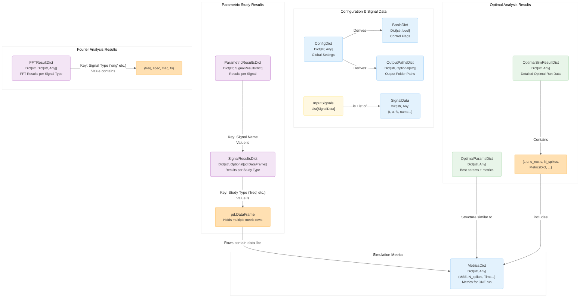

# Project Structure & Data Flow

This document provides an overview of the TEM-TDM Toolkit's directory structure, the main execution flow initiated by `launcher.py`, and the relationships between the custom data types used to pass information between modules.

## Directory Structure

The project is organized into several key directories:

*   **`/` (Root):** Contains the main entry point (`launcher.py`), configuration (`config.txt`), documentation (`README.md`), and dependencies (`requirements.txt`).
*   **`/docs/`:** Holds all documentation files, including functional descriptions and Mermaid diagrams.
*   **`/Input/`:** Place external experimental signal data files (e.g., `.csv`, `.xlsx`) here.
*   **`/Output/`:** All results generated by the toolkit (plots, summary files, logs, raw data) are saved here, organized into subfolders based on the analysis type and specific signal.
*   **`/src/`:** Contains the core Python source code, organized into sub-packages:
    *   **`/controllers/`:** Modules that manage the main workflows (`configuration.py`, `input_handler.py`, `parametric_handler.py`, `results_handler.py`). They orchestrate calls to other modules based on the configuration.
    *   **`/models/`:** Primarily focuses on generating or loading the input signals (`input_signal.py`).
    *   **`/parametric/`:** Contains the logic for executing the parametric sweeps (`studies.py`).
    *   **`/analysis/`:** Holds modules for specific post-processing analyses (`nyquist.py`, `optima.py`, `fourier.py`).
    *   **`/utilities/`:** Contains shared functions used across multiple modules, such as the core ASDM encode/decode logic (`asdm.py`), metric calculations (`metrics.py`), plotting (`plotting.py`), logging (`logging.py`), and general file/data handling (`utils.py`).

````mermaid
%%{
  init: {
    'theme': 'base',
    'themeVariables': {
      'primaryColor': '#ffffff',       %% Node background
      'primaryTextColor': '#333',      %% Node text
      'lineColor': '#666',            %% Arrow color
      'fontSize': '14px',
      'primaryBorderColor': '#bbb',    %% Default border
      'clusterBkg': '#f9f9f9',        %% Subgraph background
      'clusterBorder': '#aaa'          %% Subgraph border
    }
  }
}%%
graph TB

    %% -------------------------------- Styles (Applying Workflow Template Visuals) --------------------------------
    %% Using workflow colors for consistency, even if semantics differ
    classDef inputStyle fill:#e3f2fd,stroke:#90caf9,stroke-width:1px,color:#333,rx:4,ry:4        
    classDef processStyle fill:#fff,stroke:#888,stroke-width:1.5px,color:#000,font-weight:bold,rx:4,ry:4 
    classDef outputStyle fill:#e8f5e9,stroke:#a5d6a7,stroke-width:1px,color:#333,rx:4,ry:4      
    classDef helperStyle fill:#f3e5f5,stroke:#ba68c8,stroke-width:1px,color:#333,rx:2,ry:2        
    classDef externalStyle fill:#ffe0b2,stroke:#ffb74d,stroke-width:1px,color:#333,rx:2,ry:2      
    classDef fileOutputStyle fill:#e8f5e9,stroke:#a5d6a7,stroke-width:1px,stroke-dasharray: 3 3,color:#555,rx:4,ry:4 
    classDef descStyle font-size:0.9em,color:#444,font-style:italic

    %% Apply styles semantically to directory elements
    %% Top folders: Use Input Style (Blue)
    %% Subfolders: Use Helper Style (Purple)
    %% Entry Point: Use Output Style (Green) - stands out
    %% Config File: Use External Style (Orange) - special input
    %% Regular Files: Use Process Style (White/Grey, but not bold)
    %% Output Subfolders: Use FileOutputStyle (Green Dashed)


    %% -------------------------------- Project Structure Diagram (Styled like Workflow) --------------------------------

    ROOT["TEM-TDM Toolkit Root"]:::inputStyle 

    %% --- Top Level Files ---
    LAUNCHER[launcher.py<br/><span class='desc'>Entry Point</span>]:::outputStyle 
    CONFIG[config.txt<br/><span class='desc'>Configuration</span>]:::externalStyle
    README[README.md]:::processStyle 
    REQUIREMENTS[requirements.txt]:::processStyle 
    COLAB[TEM-TDM_Toolkit.ipynb]:::processStyle 

    %% --- Top Level Folders ---
    DOCS_DIR["/docs/<br/><span class='desc'>Documentation</span>"]:::inputStyle 
    INPUT_DIR["/Input/<br/><span class='desc'>Input Data Files</span>"]:::inputStyle 
    OUTPUT_DIR["/Output/<br/><span class='desc'>Generated Results</span>"]:::inputStyle 
    SRC_DIR["/src/<br/><span class='desc'>Source Code</span>"]:::inputStyle 

    %% --- Source Code Subfolders ---
    subgraph SRC_CONTENT ["/src/ Contents"]
       direction LR
       CTRL["/controllers/"]:::helperStyle
       MODELS["/models/"]:::helperStyle 
       PARAM["/parametric/"]:::helperStyle 
       ANALYSIS["/analysis/"]:::helperStyle
       UTILS["/utilities/"]:::helperStyle 
    end

     %% --- Output Folder Details Subgraph ---
    subgraph OUT_DETAILS ["/Output/ Contents"]
        direction LR
        OUT_PARAM[parametric_*]:::fileOutputStyle 
        OUT_ANALYSIS[nyquist, optima, fourier]:::fileOutputStyle 
    end

    %% --- Docs Folder Details Subgraph ---
    subgraph DOCS_CONTENT ["/docs/ Contents"]
        direction LR
        DOC_FUNC["/functionalities/"]:::docFolderStyle
        DOC_MAN["/managers/"]:::docFolderStyle
        DOC_RES["/resources/"]:::docFolderStyle
        DOC_PROJ[project.md]:::docFileStyle
    end


    %% -------------------------------- Connections --------------------------------
    ROOT --> LAUNCHER; ROOT --> CONFIG; ROOT --> README; ROOT --> REQUIREMENTS; ROOT --> COLAB
    ROOT --> DOCS_DIR; ROOT --> INPUT_DIR; ROOT --> OUTPUT_DIR; ROOT --> SRC_DIR;

    SRC_DIR --> SRC_CONTENT;
    OUTPUT_DIR --> OUT_DETAILS;
    DOCS_DIR --> DOCS_CONTENT;
````


## Data Type Relationships

The toolkit uses several custom type aliases (defined using `typing`) to represent the structure of data passed between modules. Understanding these relationships is key to following the data flow.



## Main Execution Flow (`launcher.py`)

The `launcher.py` script orchestrates the entire process. Here's a simplified view of its workflow and the data types involved at each step:

**Key steps in the launcher:**

1.  **Load Configuration:** Reads `config.txt` into a `ConfigDict`.
2.  **Get Flags:** Extracts boolean control flags (`BoolsDict`) from the `ConfigDict`.
3.  **Setup Folders:** Creates the necessary output directory structure based on config and flags, returning paths in `OutputPathsDict`.
4.  **Get Input Signal(s):** Calls the `input_handler` to load or generate signals, returning a list of `SignalData` dictionaries (`InputSignals`).
5.  **Execute Workflow (Conditional):** If the `'execute'` flag is true, calls the `parametric_handler`, passing necessary data. This handler returns potentially complex results structured as `ParametricResultsDict`.
6.  **Results Workflow (Conditional):** If the `'results'` flag is true, calls the `results_handler`, passing necessary data, including potentially the `ParametricResultsDict` from the previous step (if it ran). This handler performs the final analyses and saves results primarily as files.


```mermaid

```
